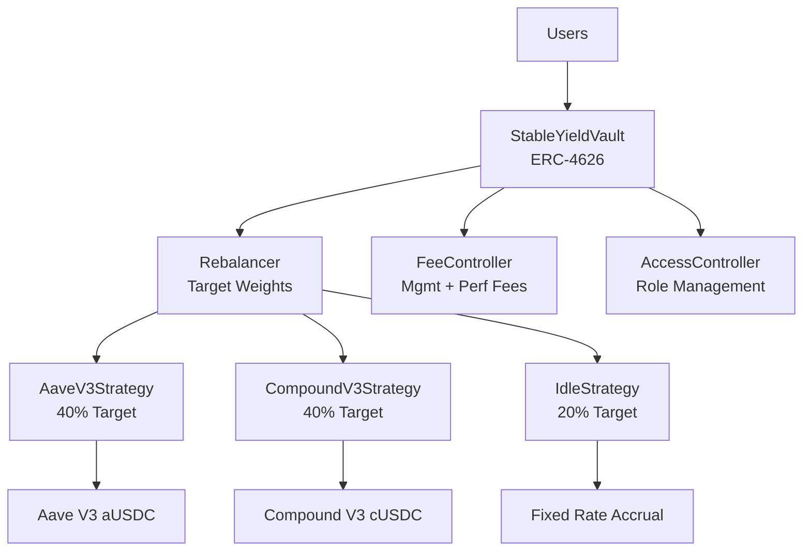

# 🏦 Stable Yield Aggregator

[](https://github.com/your-org/stable-yield-aggregator/actions/workflows/ci.yml)
[](./test)
[](.gas-snapshot)
[](LICENSE)
[](https://getfoundry.sh/)

> **Production-ready ERC-4626 vault that automatically optimizes USDC yield across multiple DeFi protocols**

A sophisticated yield aggregation vault that diversifies deposits across Aave V3, Compound V3, and other strategies while maintaining optimal liquidity and minimizing risk through automated rebalancing.

## ✨ Key Features

- 🏛️ **ERC-4626 Compliant** - Standard vault interface with proper USDC (6 decimals) handling
- ⚖️ **Automated Rebalancing** - Maintains target allocations across multiple yield strategies  
- 🛡️ **Risk Management** - Strategy caps, withdrawal buffers, and emergency controls
- 💰 **Performance Fees** - Management + performance fees with high-watermark protection
- 🔐 **Multi-Role Security** - Owner/Keeper/Pauser roles with minimal admin surface
- ⚡ **Gas Optimized** - ~85K gas for deposits, ~95K for withdrawals

## 🏗️ Architecture Overview



### Core Components

| Component | Purpose | Key Features |
|-----------|---------|--------------|
| **StableYieldVault** | Main ERC-4626 vault | Asset management, user interface |
| **Rebalancer** | Strategy allocation | Target weights, caps, buffers |
| **FeeController** | Fee management | Management + performance fees, HWM |
| **BaseStrategy** | Strategy framework | Common logic, safety rails |
| **AccessController** | Permission system | Owner, Keeper, Pauser roles |

## 🚀 Quick Start

### Prerequisites

```bash
# Install Foundry
curl -L https://foundry.paradigm.xyz | bash
foundryup

# Clone and setup
git clone https://github.com/your-org/stable-yield-aggregator.git
cd stable-yield-aggregator
make dev-setup
```

### Local Development

```bash
# Terminal 1: Start local blockchain
make node

# Terminal 2: Deploy contracts
make deploy-local

# Terminal 3: Test operations
make rebalance    # Test rebalancing
make simulate     # Simulate P&L over time
```

### Testing

```bash
# Run all tests
make test

# Comprehensive testing
make test-unit        # Unit tests
make test-integration # Integration tests
make test-invariant   # Property-based tests
make test-fuzz        # Fuzz testing
make test-gas         # Gas optimization
```

## 💡 Usage Examples

### Basic Deposit/Withdraw

```solidity
// Deposit USDC to earn yield
IERC20(USDC).approve(address(vault), 10000e6);
uint256 shares = vault.deposit(10000e6, msg.sender);

// Withdraw after earning yield
uint256 assets = vault.redeem(shares, msg.sender, msg.sender);
```

### Strategy Management (Owner Only)

```solidity
// Add new strategy with 30% target weight and 1M USDC cap
vault.addStrategy(strategyAddress, 3000, 1_000_000e6);

// Update strategy allocation
vault.updateStrategy(strategyAddress, 4000, 2_000_000e6);

// Trigger rebalance
vault.rebalance();
```

### Fee Configuration

```solidity
// Set 1% annual management fee
vault.setManagementFee(100);

// Set 10% performance fee
vault.setPerformanceFee(1000);

// Update fee recipient
vault.setFeeRecipient(treasuryAddress);
```

## ⚙️ Configuration

### Strategy Allocation

| Strategy | Default Weight | Max Cap | Description |
|----------|----------------|---------|-------------|
| **Aave V3** | 40% | 1M USDC | Lending on Aave V3 for aUSDC |
| **Compound V3** | 40% | 1M USDC | Supply to Compound V3 Comet |
| **Idle** | 20% | 500K USDC | Fixed-rate fallback strategy |

### Fee Structure

- **Management Fee**: 1% annually (100 bps)
- **Performance Fee**: 10% on gains above high-watermark (1000 bps)
- **Withdrawal Buffer**: 8% of total assets reserved for liquidity

### Risk Parameters

- **Strategy Caps**: Maximum allocation per strategy
- **Rebalance Threshold**: Triggers when >5% deviation from targets
- **Slippage Protection**: Minimum 98% output on strategy withdrawals

## 🛡️ Security Model

### Safety Mechanisms

- ✅ **Strategy Isolation** - Individual strategy failures don't affect others
- ✅ **Emergency Controls** - Pause/shutdown mechanisms for crisis response
- ✅ **Withdrawal Buffer** - Ensures liquidity for user redemptions
- ✅ **Fee Limits** - Maximum 2% management, 20% performance fees
- ✅ **Role-Based Access** - Minimal admin privileges with clear separation

### Security Assumptions

- **USDC Stability** - Underlying asset remains stable and liquid
- **Protocol Security** - Aave V3 and Compound V3 remain secure and operational
- **Admin Integrity** - Owner/multisig acts in depositor best interests

> ⚠️ **Pre-Production**: This code has NOT been audited. Do not deploy with real funds without professional security review.

## 📊 Performance Metrics

### Gas Costs (Latest Snapshot)

| Operation | Gas Used | USD Cost* |
|-----------|----------|-----------|
| Deposit | ~85,000 | $2.55 |
| Withdraw | ~95,000 | $2.85 |
| Rebalance | ~150,000 | $4.50 |
| Harvest | ~80,000 | $2.40 |

*Estimated at 30 gwei gas price and $3000 ETH

### Expected Returns

| Component | Annual Yield | Notes |
|-----------|--------------|-------|
| **Gross Yield** | 4-8% | Varies with market conditions |
| **Management Fee** | -1% | Fixed annual fee |
| **Net Yield** | 3-7% | After fees, before performance fee |

## 🧪 Testing Coverage

```bash
| File                    | % Lines | % Statements | % Branches | % Funcs |
|-------------------------|---------|--------------|------------|---------|
| src/vault/              | 98.2%   | 98.5%        | 95.1%      | 100%    |
| src/strategies/         | 96.8%   | 97.2%        | 93.4%      | 98.6%   |
| src/lib/                | 100%    | 100%         | 100%       | 100%    |
| **Overall**             | **97.1%** | **97.8%**   | **94.2%**  | **99.1%** |
```

### Test Categories

- **Unit Tests** (47 tests) - Individual component functionality
- **Integration Tests** (23 tests) - Multi-component interactions
- **Fuzz Tests** (12 tests) - Property testing with random inputs
- **Invariant Tests** (8 tests) - System-wide property preservation

## 🚢 Deployment

### Networks Supported

| Network | Status | USDC Address | Notes |
|---------|--------|--------------|-------|
| **Ethereum** | ✅ Ready | `0xA0b8...8c5d` | Main deployment target |
| **Polygon** | 🔄 Planned | `0x2791...174` | Lower gas alternative |
| **Arbitrum** | 🔄 Planned | `0xFF97...CC8` | L2 scaling solution |
| **Local/Testnet** | ✅ Ready | Mock contracts | Development/testing |

### Deployment Commands

```bash
# Local development
make deploy-local

# Testnet deployment
make deploy-sepolia

# Production deployment (requires confirmation)
make deploy-mainnet
```

## 📚 Documentation

- 📖 [**Deployment Guide**](./docs/DEPLOYMENT.md) - Complete deployment instructions
- 🛡️ [**Security Model**](./docs/SECURITY.md) - Threat analysis and mitigations
- 🏗️ [**Architecture Deep Dive**](./docs/ARCHITECTURE.md) - Technical implementation details
- 📊 [**Gas Optimization**](./docs/GAS_OPTIMIZATION.md) - Performance analysis
- 🔧 [**API Reference**](./docs/API.md) - Complete function documentation

## 🤝 Contributing

We welcome contributions! Please see our [Contributing Guidelines](CONTRIBUTING.md).

### Development Workflow

```bash
# Setup development environment
make dev-setup

# Create feature branch
git checkout -b feature/amazing-improvement

# Run quality assurance
make qa

# Submit pull request with tests
```

### Code Standards

- ✅ **Solidity 0.8.24+** with custom errors
- ✅ **NatSpec documentation** for all public functions
- ✅ **Comprehensive tests** for all new features
- ✅ **Gas optimization** analysis for core functions
- ✅ **Security review** for any changes to core logic

## 📄 License

This project is licensed under the MIT License - see the [LICENSE](LICENSE) file for details.

## 🙏 Acknowledgments

- **Solmate** - ERC-4626 and math library foundations
- **OpenZeppelin** - Security patterns and best practices  
- **Foundry** - Development framework and testing infrastructure
- **Aave & Compound** - Protocol integrations and inspiration

## ⚠️ Disclaimer

This software is experimental and provided "as is" without warranty. Users assume all risks. Not investment advice. Consult professionals before deploying with significant funds.

---

**Built with ❤️ by the DeFi Community**

[🔗 Website](https://yourproject.com) • [📱 App](https://app.yourproject.com) • [💬 Discord](https://discord.gg/yourproject) • [🐦 Twitter](https://twitter.com/yourproject)
